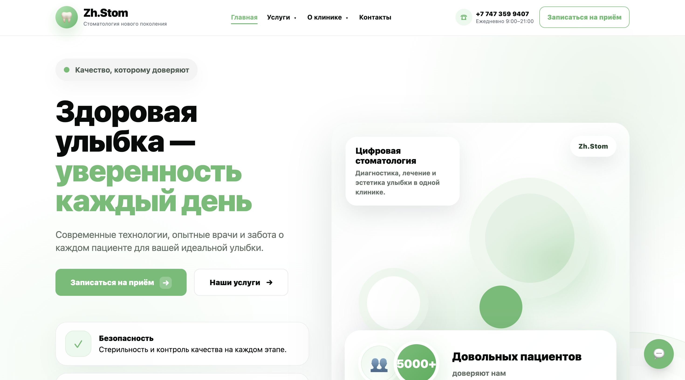
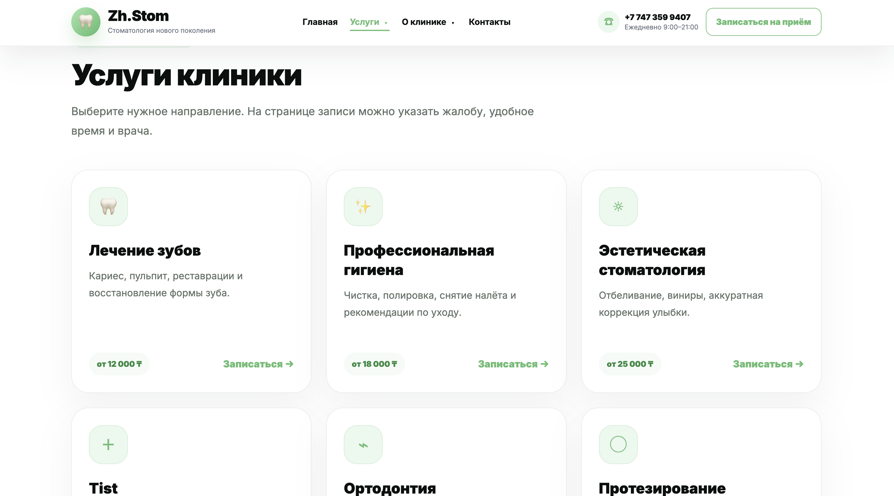
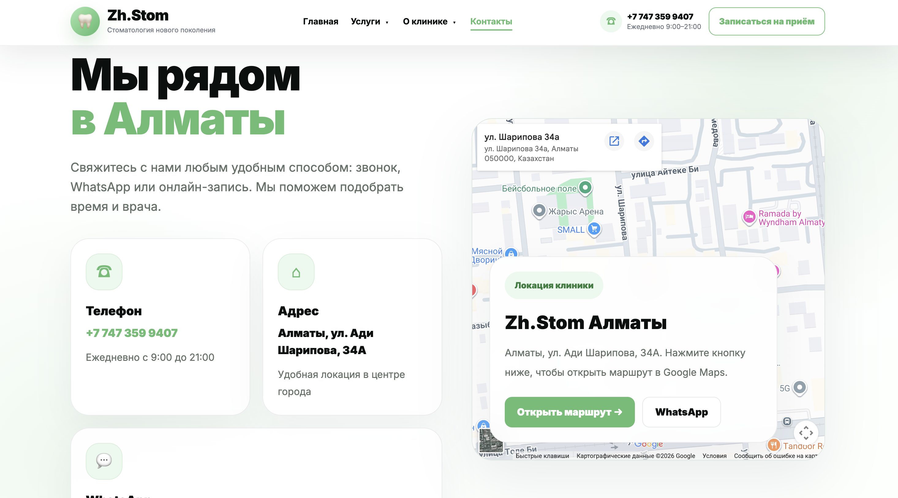

# 🦷 Zh.Stom

Modern dental clinic website built with HTML, CSS, JavaScript, Node.js, Express, and SQLite.

## ✨ Features

- Online appointment booking
- Secure authentication
- Admin panel
- Patient request management
- REST API integration
- Responsive design

## 🛠️ Tech Stack

- HTML5
- CSS3
- JavaScript
- Node.js
- Express.js
- SQLite

## 📸 Screenshots

### Home Page



### Appointment Page



### Contacts



## 🚀 Installation

```bash
npm install
```

```bash
npm start
```

Open:

```
http://localhost:3000
```
